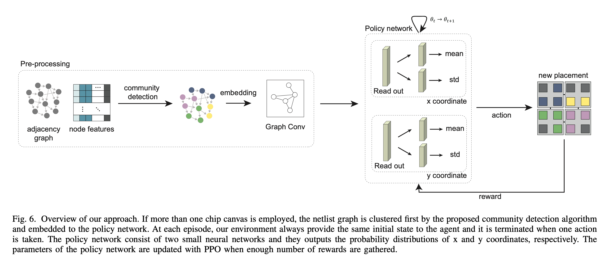

# Policy Gradient-based Core Placement Optimization for Multi-chip Many-core systems

## Supported algoritms
* Exact Mapping (zigzag, neighbor)
* Random Search
* Simulated Annealing
* Reinforcement Learning

## AS-IS:
* Mapping algorithm for single-chip system is available.
* Community detection code is uploaded, but it is currently not compatible this code.
* Execution for multi-chip system is not yet uploaded.
